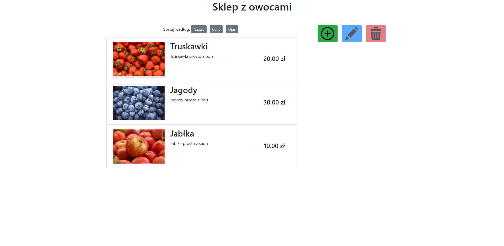
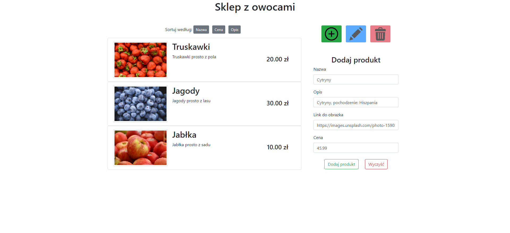
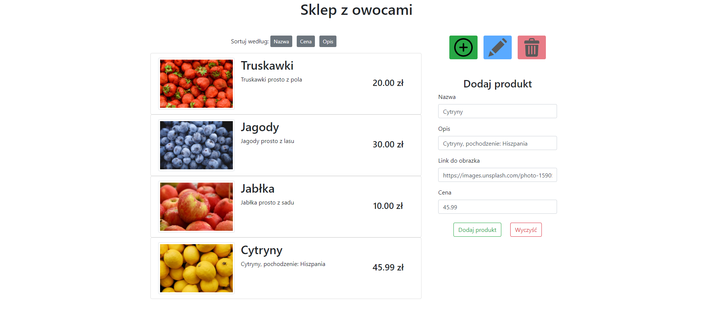
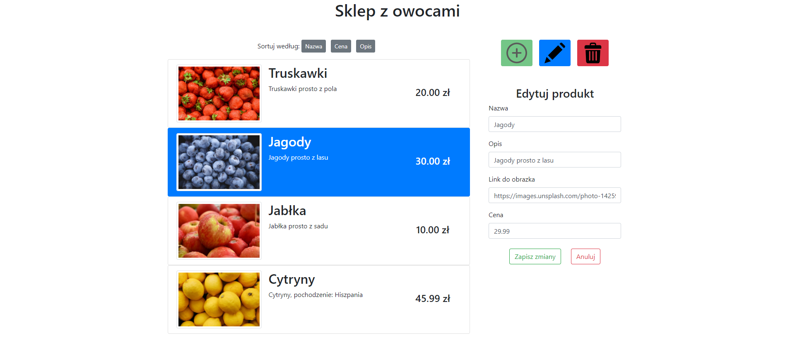
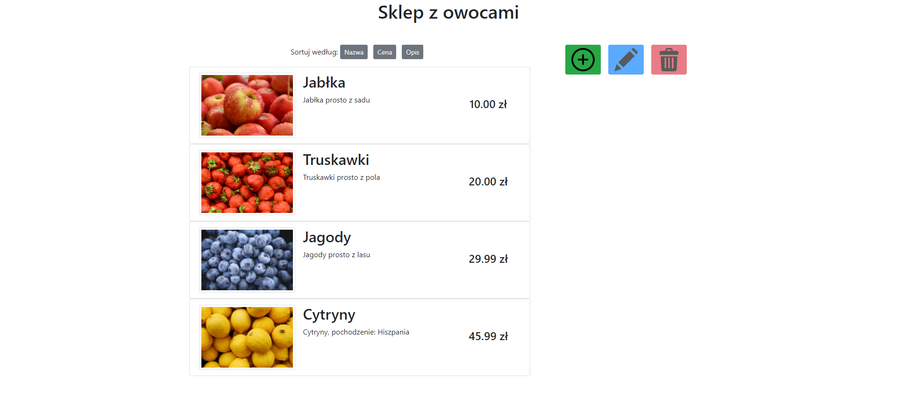

# projekt Angular
Prosta aplikacja typu SPA (Single Page Application) wykorzystująca framework front-endowy Angular

## Table of contents
* [Informacje ogólne](#informacje-ogólne)
* [Technologie](#technologie)
* [Funkcjonalności](#funkcjonalności)
* [Zrzuty ekranu](#zrzuty-ekranu)
* [Konfiguracja projektu](#konfiguracja-projektu)
* [Opis kodu](#opis-kodu)
* [Link do projektu](#link-do-projektu)

## Informacje ogólne
Projekt 2 (Javascript) z przedmiotu Zaawansowane Aplikacje Internetowe - Okno PW. Autor: Maciej Karasiński

## Technologie
* Angular 
* Bootstrap

## Funkcjonalności
* możliwość dodawania, edycji, usuwania produktów z listy,
* aplikacja działa wyłącznie po stronie przeglądarki,
* przykładowe produkty po uruchomieniu aplikacji (3),
* wykorzystanie komponentów do renderowania produktów,
* możliwość sortowania produktów po cenie, nazwie, opisie
* wykorzystanie localStorage do zapisania danych w podręcznej pamięci przeglądarki
* brakuje filtrowania

## Frameworki
W projekcie wykorzystałem framework Angular 9, oraz Bootstrap 4. Angular jest powszechnie wykorzystywany w dużych, skomplikowanych projektach (np. system bankowy). Dzieje się tak ponieważ, wymusza dobre praktyki na programiście (m. in. typowanie zmiennych) i projekty są łatwiejsze w utrzymaniu. Posiada natomiast wysoki próg wejścia dla początkującego programisty. Do tak małego projektu łatwiej byłoby wykorzystać Vue Js, albo React JS. Wybrałem Angular, ponieważ chciałem się go nauczyć/potrenować. Bootstrap jest najpopularniejszym frameworkiem CSS. Udostępnia gotowe klasy, aby szybciej można było tworzyć interfejs użytkownika.

## Zrzuty ekranu   
* Domyślny widok aplikacji   

  

* Formularz do dodawania produktów   

  

* Po dodaniu produktu   

  

* Edycja produktu
Aby edytować produkt, należy go wybrać, klikając lewym przyciskiem, następnie wybierając przycisk edycji. Usuwanie odbywa się podobnie, tylko pomijając uzupełnianie formularza.

  

* Sortowanie po cenie, rosnąco
Po jednym kliknięciu w dany przycisk produkty zostaną posortowane rosnąco, po kolejnym malejąco.

  

## Konfiguracja projektu
Aplikację można zobaczyć online, pod linkiem: https://angular-project-zaj.vercel.app/

Aby uruchomić projekt lokalnie należy:
* Wypakować przesłane archiwum / pobrać archiwum z repozytorium na github / sklonować repozytorium: git clone https://github.com/maciejkarasinski/projektAngular.git
* Uruchomić konsolę systemową w folderze projektu
* Wpisać komendę npm install (wymagane posiadanie Node JS na komputerze)
* Po instalacji wpisać komendę npm start
* Po uruchomieniu projektu przejść do przeglądarki na stronę: http://localhost:4200/

## Opis kodu
Ponieważ jest to aplikacja napisana w Angularze, każdy komponent składa się z 2 głównych plików <nazwa>.ts i <nazwa>.html. Pliki typescript odpowiadają za funkcjonalność komponentu, natomiast pliki .html odpowiadają za wygląd.

* Komponent app - główny komponent aplikacji, łączy działanie pozostałych komponentów, wywołuje potrzebne funkcje
* data.service.ts - serwis odpowiedzialny za wszelkie operacje związane z danymi w aplikacji. Zaimplementowane są tu funkcje do dodawania, usuwania, edycji, sortowania, odczytu produktów. Produkty są magazynowane w tabeli. Serwis odpowiada również za zapisywanie/pobieranie danych z localStorage przeglądarki.
* Komponent item-list Odpowiada za wyświetlanie listy wszystkich produktów, korzystając z data.service. Odpowiada również za wybranie odpowiedniego produktu, do edycji/usunięcia, za pomocą przypisanego id.
* Komponenty add i edit odpowiadają za funkcjonowanie formularzy do dodawania/edycji produktów. Wykorzystano reaktywne formularze Angulara.
* Komponent form-input odpowiada za wyświetlanie, działanie, walidację pojedynczego pola w formularzu (input + label + errorMessage).
* Item.ts - zaimplementowany interfejs obiektu Item (możliwości typescript - aby unikać błędów przy pisaniu kodu)
* app.module.ts Moduł angulara, który umożliwia współdziałanie komponentów

Komponenty komunikują się pomiędzy sobą za pomocą @Input, @Output, serwisu

## Link do projektu
Projekt znajduje się pod linkiem https://angular-project-zaj.vercel.app/
